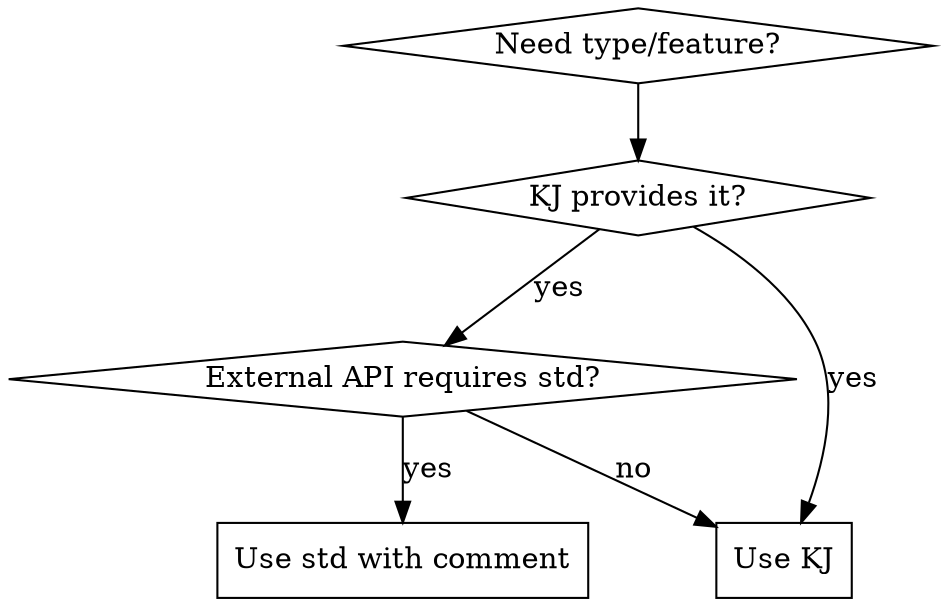

# KJ Library Skill

## Overview

KJ is Cap'n Proto's utility library providing memory management, async I/O, thread safety, strings, exceptions, and more. **KJ is VeloZ's DEFAULT library choice** - always prefer KJ types over std equivalents.

## Quick Reference: Type Mappings

| Category | Use KJ | Use std Only When |
|----------|---------|------------------|
| **Owned pointers** | `kj::Own<T>` + `kj::heap<T>()` | `std::unique_ptr` only if custom deleter needed |
| **Nullable values** | `kj::Maybe<T>` + `KJ_IF_SOME` | `std::optional` only for external API compatibility |
| **Strings** | `kj::String`, `kj::StringPtr`, `"_kj"`, `kj::str()` | `std::string` only for external APIs requiring it |
| **Dynamic arrays** | `kj::Vector<T>` (use `kj::Array<T>` for fixed-size) | `std::vector` only for algorithms requiring iterator semantics |
| **Thread sync** | `kj::MutexGuarded<T>` with `lockExclusive()`/`lockShared()` | `std::mutex` only if KJ unsuitable |
| **Functions** | `kj::Function<T>` for functors | `std::function` only if KJ unsuitable |
| **Exceptions** | `kj::Exception`, `KJ_ASSERT`, `KJ_REQUIRE` | `std::exception` only for external exception compatibility |
| **Async** | `kj::Promise<T>` with `.then()` | `std::future`, `std::promise` only for external API requirements |
| **Time** | `kj::Timer`, `kj::TimePoint`, `kj::Duration` | Use KJ timers in async code |
| **I/O** | `kj::AsyncIoStream`, `kj::AsyncInputStream`, `kj::AsyncOutputStream` | Use KJ async I/O for network/file operations |
| **Filesystem** | `kj::Path`, `kj::File`, `kj::Directory` | `std::filesystem` only for path operations |
| **Network** | `kj::Network`, `kj::NetworkAddress`, `kj::ConnectionReceiver` | Use KJ networking |
| **Arena alloc** | `kj::Arena` for bulk allocation | No std equivalent |

## Decision Flowchart



## When This Skill Applies

You MUST use this skill when:
- Writing C++ code in `apps/` or `libs/` directories
- Reading or reviewing C++ code in VeloZ
- Adding new types, containers, or async operations
- Migrating from std library to KJ patterns
- Working with async I/O, networking, or filesystem operations

## Common Patterns

### Memory Management
```cpp
// Owned object
kj::Own<MyType> ptr = kj::heap<MyType>(args...);

// Nullable value
kj::Maybe<int> findValue();
KJ_IF_SOME(value, findValue()) { KJ_LOG(INFO, "Found: ", value); }

// Arena allocation (bulk alloc, free all at once)
kj::Arena arena;
auto& obj = arena.allocate<MyType>(args...);
```

### Async & Promises
```cpp
// Promise chain
promise.then([](Result result) { return process(result); })
       .then([](Processed p) { KJ_LOG(INFO, p); });

// Wait at top level
kj::AsyncIoContext io = kj::setupAsyncIo();
kj::WaitScope waitScope(io.waitScope);
promise.wait(waitScope);
```

### Thread Safety
```cpp
kj::MutexGuarded<int> value;
auto writeLock = value.lockExclusive();  // Exclusive
auto readLock = value.lockShared();     // Shared
```

### String Handling
```cpp
kj::StringPtr view = "text"_kj;       // Non-owning view
kj::String owned = kj::str("Hello ", name); // Owned string
```

## Red Flags - You're Doing It Wrong

If you catch yourself doing any of these, STOP and use KJ instead:

- `std::unique_ptr` for simple ownership (use `kj::Own<T>`)
- `std::optional` (use `kj::Maybe<T>`)
- `std::string` member variables (use `kj::String`)
- `std::vector` without STL algorithm requirements (use `kj::Vector<T>`)
- `std::mutex` (use `kj::MutexGuarded<T>`)
- `std::function` when storing callbacks (use `kj::Function<T>`)
- `std::future` in async code (use `kj::Promise<T>`)

## Known std Library Requirements

These CANNOT be migrated (documented in CLAUDE.md):
- `std::string` - OpenSSL HMAC, yyjson C API, copyable structs
- `std::format` - Width specifiers (`{:04d}`, `{:.2f}`)
- `std::filesystem` - Path operations
- `std::unique_ptr` - Custom deleters, polymorphic ownership
- `std::function` - STL container compatibility, recursive lambdas
- `std::map` - Ordered iteration

## Self-Learning from KJ Tests

When encountering unfamiliar KJ patterns or APIs, **learn from the test files**:

**Test file location:** `libs/core/kj/*-test.c++`

**How to learn:**
1. Identify the feature you need (e.g., `kj::Promise`, `kj::Arena`)
2. Find corresponding test file (e.g., `async-test.c++`, `arena-test.c++`)
3. Read test cases for real-world usage patterns
4. Extract idioms and best practices from tests
5. Update this skill if you discover new patterns

**Common test files:**
- `memory-test.c++` - `kj::Own`, `kj::Maybe` patterns
- `async-test.c++` - Promise chaining, error handling
- `async-io-test.c++` - Network and async I/O
- `filesystem-test.c++` - Path operations, file I/O
- `mutex-test.c++` - Thread synchronization
- `string-test.c++` - String operations
- `arena-test.c++` - Arena allocation
- `timer-test.c++` - Timeouts and delays

**Example:** Need to understand `kj::Promise` forking?
```bash
# Search for fork() usage in tests
grep -A 10 "\.fork()" libs/core/kj/async-test.c++
```

## Detailed Reference

For complete examples, advanced patterns, and migration guides:
**REQUIRED:** See `library_usage_guide.md` in this skill directory.

## System Requirements

- **C++20+** (VeloZ uses C++23)
- **Clang 14.0+** or **GCC 14.3+**
- **Exceptions enabled** (KJ requires them)
